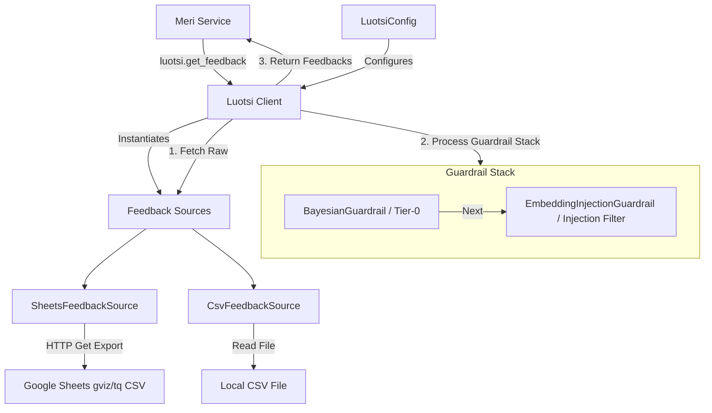

# Luotsi 🧭

Luotsi is a user feedback collection, normalization, and filtering library designed to integrate with **Meri**.

It provides interfaces to pull clickbait title generation feedback from external tabular datasources (such as Google Sheets or local CSV files), sanitizes the messages using a pipeline of security guardrails, and returns clean feedback items to improve downstream language model performance.

Both local CSV files and Google Sheets share a consolidated CSV row parsing helper to ensure identical normalization, mapping, and validation rules.

---

## Architecture Overview



---

## Installation & Configuration

Luotsi is managed as a workspace package under the main repository workspace.

### Configuration Structure (`config.yaml`)

Specify the feedback sources under the `luotsi` settings object:

```yaml
luotsi:
  sources:
    # 1. Google Sheets Source (utilizes Visualization API gviz/tq endpoint)
    - type: "sheets"
      spreadsheet_id: "your_spreadsheet_id_here"
      worksheet: "Feedback"  # Optional worksheet name

    # 2. Local CSV File Source (useful for offline testing / cache)
    - type: "csv"
      path: "/app/data/feedback.csv"
```

---

## Usage

Initialize the `Luotsi` client with your configuration and fetch filtered feedback items by article URL signature:

```python
from luotsi import Luotsi, LuotsiConfig

# 1. Initialize from config
config = LuotsiConfig(sources=[...])
luotsi = Luotsi(config)

# Alternatively, initialize directly with the root Meri settings object:
# luotsi = Luotsi(settings)

# 2. Get feedback for a specific article signature
feedbacks = luotsi.get_feedback(signature="d6f1e332ff37993df41e7a30d55e03056c5b8b184a8909e8f2afcdfe6ba9a344")

for fb in feedbacks:
    print(f"Type: {fb.type}")
    print(f"Comment: {fb.message}")
    print(f"URL: {fb.page_url}")
```

---

## Guardrails Stack

To protect title generation against malicious or junk feedback, all fetched items pass through a sequential pipeline of guardrails:

1. **`BayesianGuardrail`**: A Tier-0 statistical classifier stub intended to discard spam, empty comments, or automated junk entries.
2. **`EmbeddingInjectionGuardrail`**: An embedding-based similarity filter stub that detects and discards prompt injection attacks embedded in the feedback comments (e.g., messages containing "ignore previous instructions").

---

## Running Tests

Run the test suite using `pytest`:

```bash
uv run pytest packages/luotsi
```
